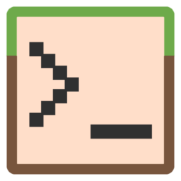
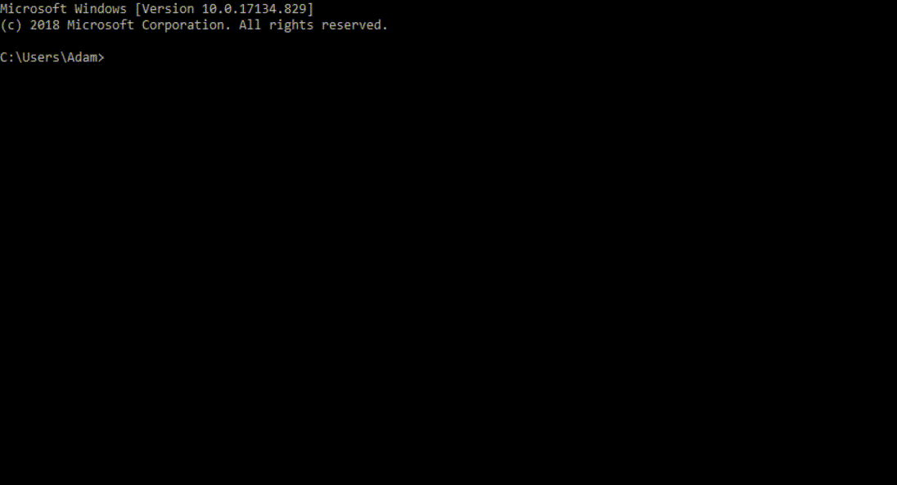

### A Bedrock mcfunction shell and interpreter


***
# FAQ
## What is Mchell?
Mchell is a shell and interpreter for running Bedrock mcfunctions. It allows you to write, test and debug mcfunctions outside of Minecraft, as well as write real programs to run on the Windows command line.

## What use does Mchell have?
Primarily, Mchell is an [esoteric programming languages](https://en.wikipedia.org/wiki/Esoteric_programming_language). It's primary goal is to challenge developers, and to make mcfunction into a useable [code golf](https://en.wikipedia.org/wiki/Code_golf) language. However, it is not without practical use. Mchell gives developers a simple work enviroment to debug and test their code, before importing it into Minecraft.

## How does Mchell work?
When you run a Mchell program, a 'virtual' Minecraft world is created. Your program then interface with this Minecraft world as if it were a real one. This creates a seamless transition between developing for Mchell and for Minecraft.

## What can Mchell do?
Many of the core features developers use within Minecraft have been implemented into Mchell. These include: Manipulating Blocks, Manipulating Entities and Manipulating Scoreboards. Mchell also contains some custom syntax to allow developers to read from standard input (using /scoreboard) and write to standard output (using /say). Mchell is turing complete though, so go nuts!

## What can't it do?
At the moment, you can't make any system calls except reading from STDIN and writing to STDOUT. Some Minecraft commands are also not currently supported. The list of supported commands can be found below.

***
# Installation and Use
## Download 
- **[Mchell V1.0.0 for Windows](https://github.com/byAdam/Mchell/releases/tag/V1.0.0)**

## Using Mchell
When you install Mchell, it adds "mchell" as a system command (Windows).
You can run a program on the interpreter by specifying the path of the main mcfunction as a command line argument. The directory of the mcfunction file will act as the root directory. If no path is specified, Mchell will enter the shell.
The main mcfunction file is ran relative to an entity of type "player" and name "main" 

There is a number of flags you can specify:
- -h, --help: Output a list of valid arguments
- -r, --read: Import world from 'world.json'
- -w, --write: Export world to 'world.json' on exit
- -l, --loop: Runs the program 20 times per second until exit
- -d, --dir = VALUE: Set the base directory of the program

## Bugs and Issues
Please report any bugs and issues you find [here](https://github.com/byAdam/Mchell/issues). If you have any questions or queries, feel free to contact me by email (adambrady2000@gmail.com) or on [Twitter](https://twitter.com/byAdam_Net)
***
# Technical Details

## Implemented Commands
- /setblock
- /fill
- /summon 
- /kill
- /tp
- /execute
- /function
- /tag
- /scoreboard
- /say
- /debug
- /exit

## Implemented Selectors
- @a
- @e
- @p
- @r
- @s

## Implemented Selector Arguments
 - x, y, z
 - dx, dy, dz
 - r, rm
 - name
 - scores
 - tag
 - type
 - c

## Custom Syntax
scoreboard players input \<target> \<objective>
- Reads a line from STDIN
- The input will be saved as a score to the targets for that objective
- If the line is an integer, the input will the integer
- If the line consists of a single UNICODE character, the input will be the UNICODE code of the character
- If the line is blank, the input will be 0
- If the line consists of more than one UNICODE character, an error will be raised
- E.G scoreboard players input @a example

say
- Writes a line to STDOUT
- SELECTOR\*OBJECTIVE = Returns the score for the objective for the target entities
  - E.G @a\*example
- SELECTOR#OBJECTIVE = Returns the UNICODE Character corresponding to the score for the objective for the target entities
  - E.G @a#example
  - Entering a ^ character after the # will combine the characters into a single string
    - E.G @a#^example
- $(x,y,z) = Returns block and data value at those coordinates in the form "block:data"
  - E.G $(0,~5,10)

exit
- Exits the program

debug \<target> \[prefix]
- Outputs the entity data for all targeted entities
- The prefix will be at the start of the line before the data, by default, it is "DEBUG"
- E.g debug @a HELLO

[def FUNC_NAME](#defining-function)
- Defines a function within a mcfunction file
- You do this by typing `def FUNC_NAME` followed by a number of indented lines
- Note: When a mcfunction is called for the first time, any functions defined within it will overide functions with the same name
- E.G
```
def loop
    say This is a loop
    function loop

say Before Loop
function loop
```

## Structure
### World
Consist of: blocks, entities, scoreboard objectives
### Entity
Consist of: position, uuid, type, name, tags
### Block
Consists of: a position, identifier, data value
### Scoreboard Objective
Consits of: entities with a non-null score
